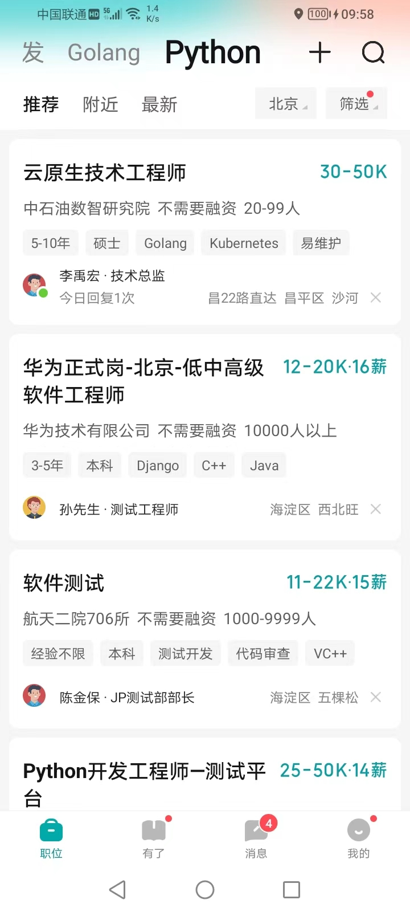

# 使用Appnium Python自动化安卓/IOS应用测试
## 目标
### 前言

节省时间在立即沟通上，反正目前也没什么好的机会，广撒网。
由于爬虫容易被封，所以试试Appium，比较适合用找个旧手机来慢慢投简历。
测试了一下，每个职位大概耗时不到30秒，反正boss每天投简历也有限制。
纯粹为爱发电，觉得不错加个小心心。
目前只有安卓环境，还没试过IOS:穷。
v我50搭建IOS环境
### 实现功能
使用Appium Python自动化Boss直聘沟通与简历投递，实现以下功能：
  - 启动Boss直聘App(简历已经准备好)
  - 检索推荐的职位，筛选出符合条件的职位
    - 大体符合要求的职位（技能点符合2个以上）
    - 离家距离在指定范围内的职位 
  - 点击符合条件的职位，进入职位详情页
    - 点击立即沟通
  - 进入消息页
    - 遍历消息
    - 点击未读消息
    - 如果HR有回复，发送消息给HR告知自己的年龄
    - 对回复进行分析，如果确定没有年龄限制，则发送简历给HR

## 测试环境
Windows 11
Python 3.12
Appium Server
Appium Inspector
Boss直聘App(需要提前准备好在线简历)
硬件:荣耀40手机

## Appium Python 环境配置
### 安装Appium Python库
```
pip install Appium-Python-Client
```
### 安装node.js与npm

```
请参照官方文档安装对应平台
```
### 安装Appium Server
```
npm install -g appium
```
### Appium Server 启动
##### 为了避免权限问题，需要启动Appium Server时加上参数：
```
appium --relaxed-security
```
### ADB 连接

#### 由于测试手机为华为系的荣耀，对Android系统改动比较大，所以启用开发者模式时，adb无法连接，解决方法就是下载抽取的荣耀驱动
```
分别进入all与new文件夹，分别运行DriverUninstall.exe
```

### Appium Inspector Desired Capabilities 配置
```
{
  "platformName": "Android",
  "appium:platformVersion": "12.0",
  "appium:deviceName": "RKY-AN00",
  "appium:udid": "A9TR9X3522W02769",
  "appium:appPackage": "com.hpbr.bosszhipin",
  "appium:appActivity": "com.hpbr.bosszhipin.module.splash.activity.SplashActivity",
  "appium:appWaitActivity": "com.hpbr.bosszhipin.module.main.activity.MainActivity, com.hpbr.bosszhipin.module.splash.activity.SplashActivity",
  "appium:automationName": "UiAutomator2",
  "appium:ensureWebviewsHavePages": true,
  "appium:nativeWebScreenshot": true,
  "appium:newCommandTimeout": 3600,
  "appium:connectHardwareKeyboard": true,
  "appium:noReset": true
}
```
##### 由于Boss直聘APP的appActivity使用默认的com.hpbr.bosszhipin.module.main.activity.MainActivity 会报错，所以只能启动到主界面，然后手机上点击Boss直聘APP图标进入，然后进行元素定位

### Python启动代码
#### Python可以使用
```
adb shell monkey -p com.hpbr.bosszhipin -c android.intent.category.LAUNCHER 1
```

### 运行代码
#### 修改.env文件
  - ##### 将CAPABILITIES_FILE_NAME修改为手机的包含Desired Capabilities信息的json文件
  - ##### 设置JOB_NUM的数量，每个期望职位都会投递JOB_NUM个职位，因为Boss直聘的职位以卡片组的形式组织，每个卡片组显示4个职位，可能实际会多于设定的JOB_NUM

```
REMOTE_URL= http://<Appium server address>:4723
CAPABILITIES_FILE_NAME=boss_honor_capabilities.json
JOB_NUM=1
```
```
python boss_android.py
```

### 默认是模拟点击立即沟通，如果实际投递，需要将函数jobs_apply中的job_card_detail_page_click_simulate(driver)注释掉并取消注释job_card_detail_page_click_chat(driver)

```
job_card_detail_page_click_simulate(driver)
#job_card_detail_page_click_chat(driver)
```

#### 运行结果如下：
```
2024-09-24 09:06:56,722 - jobs_data_output - INFO - 兼职系统工程师投递数为4
2024-09-24 09:06:56,722 - jobs_data_output - INFO - 兼职运维工程师投递数为4
2024-09-24 09:06:56,722 - jobs_data_output - INFO - 兼职测试开发投递数为4
2024-09-24 09:06:56,722 - jobs_data_output - INFO - 兼职Golang投递数为4
2024-09-24 09:06:56,722 - jobs_data_output - INFO - 兼职Python投递数为4
2024-09-24 09:06:56,722 - jobs_data_output - INFO - 测试开发投递数为4
2024-09-24 09:06:56,722 - jobs_data_output - INFO - Golang投递数为4
2024-09-24 09:06:56,722 - jobs_data_output - INFO - Python投递数为4
2024-09-24 09:06:56,725 - jobs_data_output - INFO - 总投递数为32
2024-09-24 09:06:56,725 - timer - INFO - retrive_expected_jobs 函数运行时间: 13.96 分钟
```

##图片参考

<div style="text-align: center;">
    
    <p>Boss直聘界面</p>
</div>

